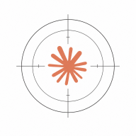

<p align="center">
  
</p>

# nephoscope

*Stop Claude Code asking about the same commands twice.*

Claude Code asks for permission before every shell command, file write, or web fetch. That's good for safety — until you've answered the same prompt twenty times in a row. Nephoscope watches your answers, turns the recurring ones into persistent rules, and writes those rules straight into your Claude Code settings. The yellow popups quietly disappear. Everything happens locally.

## What it does

- **Learns from your answers.** Every *Allow* or *Deny* you click is recorded, and recurring patterns surface as rules you can promote with one command.
- **Scopes rules the way you work.** Allow a tool everywhere, or only inside one project, or just for this one chat — your choice, per rule.
- **Stays out of the way.** Rules are written into your normal `settings.json`, so Claude Code's built-in permission gate handles them without any hook round-trip.
- **Ships with credential-leak guards.** Out of the box, nephoscope denies reads of well-known credential files (`.env` files, `~/.aws/credentials`, `~/.kube/config`, `~/.docker/config.json`, `~/.npmrc`, `~/.netrc`, bash and zsh history) and blocks standalone secret-manager reads (`op read`, `vault kv get`, and others). The safe inline form — `$(op read 'op://...')` — is unaffected.

## Why nephoscope

Nephoscope works the same way regardless of which Claude Code tier you're on (Pro, Max, Team, Enterprise) or which model you're using (Opus, Sonnet, Haiku) — the rules live in your local settings and Claude Code's built-in permission gate enforces them. It's a middle ground between the rough edges of other approaches: unlike bypass mode, it doesn't disable credential-leak guards; unlike the default "ask every time", it learns from your own answers and respects your project and session boundaries. The rules are yours to shape, and they travel with your settings.

## Install

From inside a Claude Code session:

```
/plugin marketplace add bedezign/nephoscope
/plugin install nephoscope@bedezign
```

The first new session auto-installs a small Python environment under the plugin's data directory. No config files to edit, no path setup, no SQL migrations to run.

## In a hurry?

```
/nephoscope:permissions status                                   # see what's learned
/nephoscope:permissions promote --verb ls --flags '*' --tier global   # allow ls everywhere
/nephoscope:permissions review                                   # walk through pending suggestions
```

## Documentation

- [Getting started](docs/getting-started.md) — install, verify, your first rule
- [How it works](docs/how-it-works.md) — concepts and flow, in plain language
- [Daily use](docs/daily-use.md) — reading status, reviewing, troubleshooting
- [Recipes](docs/recipes.md) — copy-pasteable rule patterns for common situations
- [Credential-leak coverage](docs/credential-leak-coverage.md) — what's blocked by default and why
- [Reference](docs/reference.md) — environment variables, placeholders, subcommand table
- [Contributing](docs/contributing.md) — architecture, data flow, tests

## License

Apache-2.0. See [LICENSE](LICENSE).
