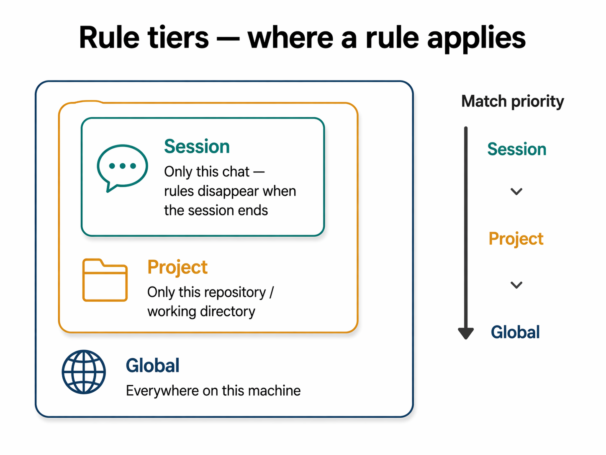
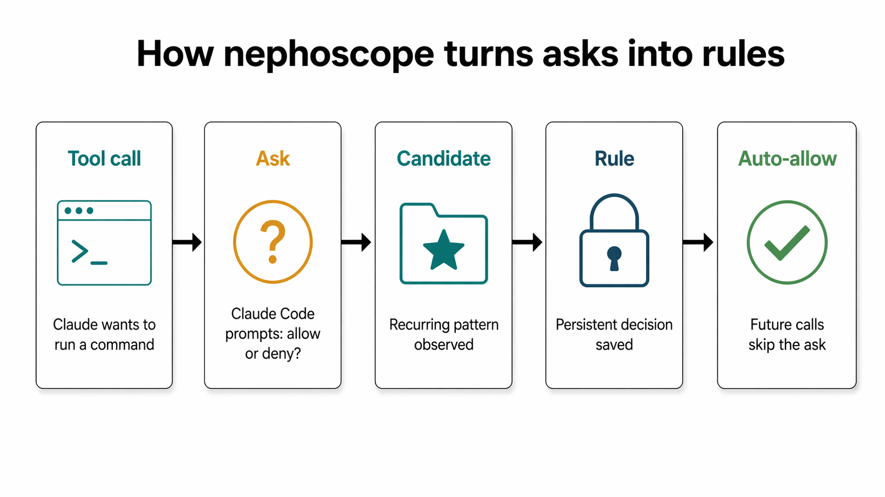

# How it works

A plain-language tour of what nephoscope does in the background, the vocabulary it uses, and the end-to-end flow that turns your click history into a stable set of permission rules. No Python required — everything is run from a Claude Code session or a normal terminal.

If you want commands right now, skip to [daily use](daily-use.md) or [recipes](recipes.md). For every flag a command takes, see [`../commands/permissions.md`](../commands/permissions.md).

## What nephoscope does for you

Claude Code asks before it runs anything that touches your machine — every shell command, every file write, every web fetch. Those prompts are good for safety, but they're also annoying once you've answered the same one twenty times in a row. "Yes, I trust `ls`. Yes, I still trust `ls`. Yes, you can read this file again."

Nephoscope sits in the background and watches what you decide. When the same kind of permission prompt keeps showing up, it offers to turn that decision into a persistent rule. Once a rule is in place, Claude stops asking — it just runs the command (or refuses it, if you said no). The result is fewer interruptions and a permission set that grows out of how you actually work, instead of one you have to plan up front.

Everything happens locally. Nephoscope keeps its data in a small database file inside the plugin's data directory, and writes the rules into your existing Claude Code settings file. Nothing is sent over the network, and you can wipe the whole memory by deleting one file.

## Key concepts

A handful of terms will keep coming back. Each one means something concrete — they're not jargon for the sake of it.

### Tool call

Every action Claude Code takes on your behalf is a *tool call*. Running `git status` is a tool call. Reading a file is a tool call. Doing a web search is a tool call. Most prompts you see — "Allow Claude to run `git status`?" — are about a single tool call.

### Ask (the permission prompt)

When Claude wants to do something and there is no rule covering it yet, it shows the yellow permission dialog. Internally nephoscope calls each one of those an *ask*. Every time you click *Allow* or *Deny*, the ask is recorded along with what you decided.

**Example.** The first time Claude wants to run `rm build/cache.txt`, you see an ask. If you click *Allow*, an ask record gets stored — verb is `rm`, the path is `build/cache.txt`, and your decision is *approved*.

### Candidate

A *candidate* is a recurring ask pattern that nephoscope thinks is worth turning into a rule. Candidates build up as you keep using Claude Code. After a few `rm` asks on similar paths, nephoscope notices and offers `rm` as a candidate for promotion. A candidate is still just a suggestion — nothing changes about Claude's behaviour until you act on it.

**Example.** You approve `rm a.txt`, `rm b.txt`, `rm build/tmp.o` on three separate occasions. Nephoscope's scanner groups those under a candidate like "`rm` with various paths" and flags it as ready for your review.

### Rule (permission)

A *rule* is the thing that makes Claude stop asking. It says "always allow this" or "always reject this" for a particular shape of tool call. Rules live in your Claude Code settings file, so the moment a rule covers an action, Claude's built-in permission gate handles it without ever calling out to nephoscope.

Rules come in two flavours: *approved* rules auto-allow a command, and *rejected* rules hard-block it. You'll get an immediate refusal on a rejected rule — no prompt.

**Example.** `Bash(git status)` in your `~/.claude/settings.json` under `permissions.allow` is a rule. Once it's there, Claude runs `git status` without asking.

### Tier

A rule has to apply *somewhere*. There are three choices:

- **session** — the rule lives only as long as your current Claude Code chat. When the chat ends, the rule is gone. Good for "let me try this for the next ten minutes." Think of session as *this conversation only*.
- **project** — the rule applies only when you're working in one specific project (one specific directory tree). Good for project-specific build tools or a scoped `rm` rule. Think of project as *this repo only*.
- **global** — the rule applies everywhere, in every project, every session. The default for things like "I always trust `ls`". Think of global as *everywhere*.

When more than one tier could match, the most specific one wins: session beats project, project beats global.



### Rule shape

A rule needs to know *what* to match on. The pieces it cares about are four attributes, and together they pick which commands the rule catches:

- **verb** — the command name. `git`, `rm`, `ls`, or an absolute path to a script like `/home/you/bin/deploy`.
- **subcommand** — the next word after the verb, when the command has one. In `git commit`, `commit` is the subcommand. In `ls -la`, there is no subcommand.
- **flags** — the options you passed. `-la`, `--amend`, and so on. You can match a specific set of flags, no flags at all, or any flags (using `*` for the latter).
- **path** — for commands that operate on files, you can restrict the rule to certain locations.

Most rules only need a verb and maybe flags. The path piece is for when you want a rule like "allow `rm` *only* inside this project".

### Placeholders

Paths change between sessions and projects, so nephoscope lets you write rules using shortcuts that get expanded each time the rule is evaluated:

- **`$HOME`** — your home directory (e.g. `/home/you`).
- **`$CWD`** — the directory Claude Code is running from in the current session (what `pwd` would print when you started it).
- **`$PROJECT_ROOT`** — the root of the project you're currently working in. Nephoscope looks at the nearest directory above you that looks like a project (for example, one containing a `.git` or `pyproject.toml`).

You can use these inside a path. For example, `$PROJECT_ROOT/**` means "anywhere inside the current project" — the `**` covers any depth. `$HOME/Downloads/**` means "anywhere in your Downloads folder."

If a path falls under a directory you have added on top of your project, nephoscope writes the rule using the real absolute path instead of a placeholder — for example, `/opt/company/shared/**`. Those inline specs work as written and are not session- or project-specific.

There are three places nephoscope looks for those extra directories:

- The **persistent list** in `~/.claude/settings.json` and `<project>/.claude/settings.local.json` — anything you put under `permissions.additionalDirectories` lives here and is shared across all sessions.
- **Launch-time flags** — `claude --add-dir /some/path` adds a directory for the lifetime of that one session. Nephoscope reads the launch arguments at session start and remembers what you added, so rules that mention those paths still match.
- **Mid-session additions** typed via the `/permissions` UI (which prints "for this session") are kept in Claude Code's memory only. Nephoscope does not see them today; if you want a runtime-added directory to be tracked, add it to `settings.local.json` instead.

## The flow



Here is the typical end-to-end loop, step by step.

1. **You fire a command.** You ask Claude Code to do something — say, `rm build/cache.txt`. If no rule matches, the yellow permission dialog appears. (On the very first encounter of a verb, this is the default experience.)
2. **You allow or deny.** Your click is recorded as an ask. Claude carries out (or refuses) the action.
3. **Patterns build up.** Behind the scenes, similar asks accumulate. After a few `rm` asks across different paths, the scanner notices the pattern and surfaces it as a candidate.
4. **You scan and propose.** Run `/nephoscope:permissions scan` to turn fresh asks into candidates. Run `/nephoscope:permissions propose` to see which candidates are ready for review.
5. **You review.** Run `/nephoscope:permissions review` for a guided walkthrough — it asks you, per candidate, whether to allow or reject and at which tier. Approved candidates become allow-rules; rejected candidates become deny-rules.

On a subsequent encounter — once the rule exists — there is no prompt. Claude Code reads the rule from its settings file and runs (or refuses) the command immediately.

## How asks become rules

There are two ways to promote an ask into a rule. Pick whichever matches your situation:

### Observation-driven: `scan → propose → review`

You let asks accumulate. Every so often — say, at the end of a day of work — you run the pipeline:

```
/nephoscope:permissions scan       # group recent asks into candidates
/nephoscope:permissions propose    # list candidates ready for review
/nephoscope:permissions review     # walk through each one and decide
```

This path is best when you don't yet have a strong opinion about which commands should be auto-allowed. Let the tool surface the patterns it sees, then judge them after the fact.

### Deliberate: `promote`

You already know you want a rule. You write it yourself:

```
/nephoscope:permissions promote --verb ls --flags '*' --tier global
```

This path is best when you've already made the decision. It skips the queue entirely — there's no candidate, no review prompt, just a new rule landing in your settings file.

The two paths are not exclusive. You can write a few rules by hand for the commands you already trust, and let the learner surface suggestions for the rest.

## Where the data lives

Everything nephoscope knows about you lives in one database file:

```
~/.claude/plugins/data/nephoscope-bedezign/observations.db
```

That file holds your asks, your candidates, and your rules. From those rules, nephoscope keeps a copy in your Claude Code settings:

- **Global-tier rules** go into `~/.claude/settings.json`.
- **Project-tier rules** go into the project's own `.claude/settings.local.json`.
- **Session-tier rules** live only in the database; they are never mirrored to a settings file.

The settings files are where Claude Code's built-in permission gate looks to decide whether to ask you. Nephoscope rewrites the relevant one every time you change a rule.

If you delete the database file, nephoscope forgets everything and starts from scratch. If you uninstall the plugin (`/plugin uninstall nephoscope@bedezign`), the hooks disappear but the settings entries remain unless you also remove them by hand.

## Next

- [Daily use](daily-use.md) — read the `status` dashboard line by line, walk through a review, and troubleshoot the common snags.
- [Recipes](recipes.md) — starter patterns you can copy straight into your session.

## See also

- [Reference](reference.md) — the full placeholder table, environment variables, and subcommand listing.
- [`../commands/permissions.md`](../commands/permissions.md) — every flag and option for every subcommand.
